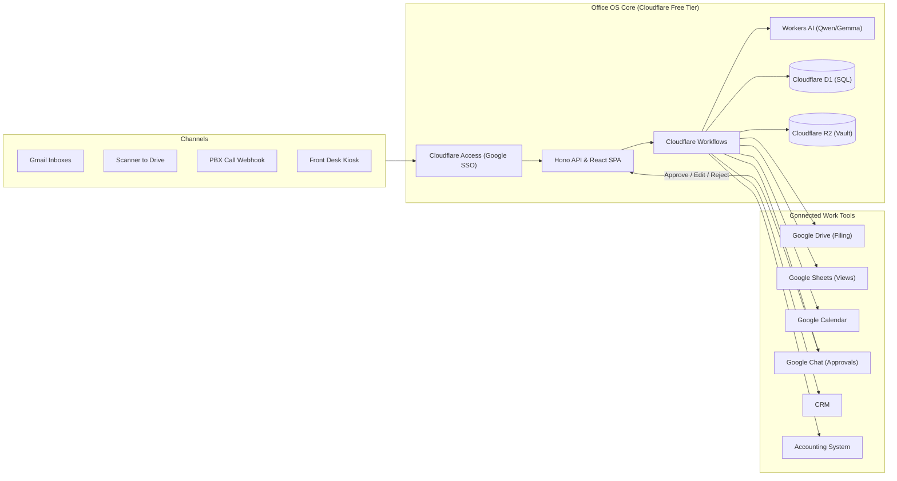

# Office OS — WorkFlowAutomation

> **The Operating System for Office Operations.**  
> Connects email, phone, paper scans, and front desk visits into a single intelligent operating system. AI captures, logs, classifies, and routes incoming items, while humans retain authority over rules, exceptions, and every external communication.

[](https://workers.cloudflare.com/)
[%20%7C%20Postgres%2016-4169E1?logo=postgresql)](https://developers.cloudflare.com/d1/)
[](https://workspace.google.com/)
[-brightgreen)](#cost-profiles-zero-budget-vs-enterprise)
[](#)

---

## 1. Executive Summary

Office information arrives from **four channels** (email, phone, paper scans, walk-ins) and typically ends up fragmented across inboxes, spreadsheets, Google Drive, filing cabinets, and the CRM. This fragmentation causes missed renewal deadlines, duplicate invoice payments, delayed correspondence, and hundreds of lost administrative hours each month.

**Office OS** provides:
1. **Unified Intake**: Ingests every email, scanned letter, call event, and walk-in instantly.
2. **Immutable Master Register**: Assigns sequential, gapless reference numbers (e.g. `IN-2026-000412`, `OUT-2026-000088`) within seconds.
3. **AI Classification & Extraction**: Understands document semantics, flags anomalies (VAT calculation errors, duplicate invoices, expiring contracts), and drafts structured entries.
4. **Autonomous Propagation**: Updates Google Drive, Google Sheets, Google Calendar, and your CRM automatically—enter information once, propagate it everywhere.
5. **Human-in-the-Loop Governance**: Every workflow operates with an explicit autonomy level (L0 to L3). High-risk items, financial postings, and all outbound communications require human approval.

---

## 2. Core Capabilities

### 🛎️ Front Desk & Administration
- **Visitor Check-In Kiosk**: iPad/tablet PWA for self-check-in, digital NDA capture, badge printing, and instant host notification via Google Chat.
- **Call Log Assistant**: Automatic capture from cloud PBX webhooks or a 10-second rapid entry form with CRM caller recognition.
- **Meeting Room Coordinator**: Real-time room booking synchronized directly with Google Calendar resource calendars.
- **Self-Updating Correspondence Register**: Inbound and outbound mail tracking, including digital vault storage and physical shelf/box filing locations with QR labels.

### 💰 Financial Coordination
- **Invoice & Receipt Pipeline**: Inbound invoices read, arithmetic validated, duplicate-checked, and filed to Drive with a draft bill created in the accounting system.
- **Expenditure & Asset Logs**: Recurring tracking for office rent, municipality taxes, electricity, water, and consumables.
- **Petty Cash Logging**: Rapid receipt capture with categorization.

### 🛡️ Asset, Licence & Renewal Tracker
- **Never-Miss Renewal Engine**: Tracks insurances, vehicle/building registrations, trade licences, and official certifications.
- **Escalation Ladders**: Automated alerts at 60, 30, 14, and 7 days before expiry, escalating to department heads if unacknowledged.

### ✍️ Management Support & Drafting Studio
- **AI Drafting Assistant**: First-pass drafts of letters, official responses, and client follow-ups generated from templates and context.
- **L2 Approval Guardrail**: All outbound correspondence is reviewed and signed off by a human before dispatch via Gmail.

---

## 3. The Autonomy Framework (L0 – L3)

To ensure safety and build organizational trust, every single workflow step is governed by an explicit autonomy policy:

```
[L0: Human Only]  ──>  [L1: AI Suggests]  ──>  [L2: AI Prepares, Human Approves]  ──>  [L3: AI Executes, Human Audits]
```

- **Level 0 (Manual Only)**: Payment disbursement, contract signing, and employee termination. AI is strictly prohibited.
- **Level 1 (AI Assisted)**: Complex legal triage, IT access provisioning checklists. AI recommends; human executes.
- **Level 2 (Human Gatekeeper)**: Outbound emails/letters, invoice draft approvals, CRM contact merges. AI prepares; human must approve.
- **Level 3 (Autonomous with Audit)**: Inbound document registration, visitor notifications, internal reminder alerts. AI executes; human audits a weekly 5% sample.

> **Automatic Demotion Circuit Breaker**: If human approvers reject or modify more than 10% of an AI model's suggestions over 50 runs, the workflow is automatically demoted by one level.

---

## 4. Cost Profiles: Zero-Budget vs. Enterprise

Office OS is engineered to run at **$0/month** by leveraging existing Google Workspace tools alongside free serverless tiers:

| Component | Zero-Budget Edition ($0/month) | Enterprise Edition (~$630–1,050/mo) |
|---|---|---|
| **App & API Hosting** | **Cloudflare Workers Free** (100k requests/day) | Cloud Run (auto-scaling containers) |
| **Relational Database** | **Cloudflare D1** (Serverless SQLite, 500 MB) | Cloud SQL Postgres 16 HA (Private IP) |
| **Document Storage** | **Cloudflare R2** (10 GB free) + Google Drive | Google Cloud Storage (CMEK, Bucket Lock) |
| **Workflow Engine** | **Cloudflare Workflows** (`step.do`, `step.sleep`) | Temporal Cloud (Durable Workflows) |
| **AI Inference & OCR** | **Workers AI** (10k free neurons/day) + Drive OCR | Claude Sonnet 3.5 / Haiku on Vertex AI |
| **Authentication** | **Cloudflare Access Free** (Up to 50 users via Google SSO) | Google Cloud Identity OIDC + Postgres RLS |
| **Audit & Logging** | D1 Audit Table + Sentry Developer Free | Google Cloud Logging + Trace + Langfuse |

👉 *For detailed setup instructions on the free stack, read the [Zero-Budget Setup Guide](docs/ZERO_BUDGET_SETUP.md).*

---

## 5. System Architecture Flow



---

## 6. Repository Layout

```
.
├── docs/
│   ├── ARCHITECTURE.md       # Comprehensive High-Level System Architecture
│   ├── ZERO_BUDGET_SETUP.md  # Detailed $0/month deployment walkthrough
│   └── SOP_TEMPLATE.md       # Standard Operating Procedure template for office teams
├── src/                      # Source code (API, Workflows, Client)
│   ├── api/                  # Hono-based REST API handlers
│   ├── workflows/            # Cloudflare Workflows durable state machines
│   ├── adapters/             # Google Workspace, CRM & Accounting integrations
│   └── client/               # React / Tailwind front-desk & register interface
├── schema.sql                # D1 / SQLite database schema migrations
├── wrangler.jsonc            # Cloudflare Workers configuration & bindings
└── README.md                 # Project introduction and operational guide
```

---

## 7. Quick Start (Zero-Budget Local Setup)

### 1. Clone & Install Dependencies
```bash
git clone https://github.com/Darl1ng-r/WorkFlowAutomation.git
cd WorkFlowAutomation
pnpm install
```

### 2. Configure Cloudflare Local Development
Make sure you have [Wrangler](https://developers.cloudflare.com/workers/wrangler/) installed:
```bash
# Login to your free Cloudflare account
npx wrangler login

# Create your local or remote D1 database
npx wrangler d1 create office_os_db
```

### 3. Initialize Database Tables
```bash
npx wrangler d1 execute office_os_db --local --file=./schema.sql
```

### 4. Run Locally
```bash
pnpm dev
```
Open your browser at `http://localhost:8787` to access the local register and mock inbox.

---

## 8. Operational Governance & SOPs

In accordance with our core design principles:
- **No system goes live without an SOP**: Every automated workflow must have a completed [Standard Operating Procedure](docs/SOP_TEMPLATE.md) signed off by the business owner.
- **Weekly Improvement Cadence**: The system owner monitors human corrections, inspects flagged anomalies, and fine-tunes AI prompts every Friday.
- **Monthly Management Report**: Built directly from live operational data, summarizing total hours saved, anomalies caught, and AI accuracy trends.

---

## 9. Documentation Index

- 📘 [Comprehensive Architecture & Implementation Plan](docs/ARCHITECTURE.md)
- 🚀 [Zero-Budget ($0/mo) Deployment Guide](docs/ZERO_BUDGET_SETUP.md)
- 📋 [Standard Operating Procedure (SOP) Template](docs/SOP_TEMPLATE.md)

---

## 10. License

Proprietary — Internal Office Automation System. All rights reserved.
