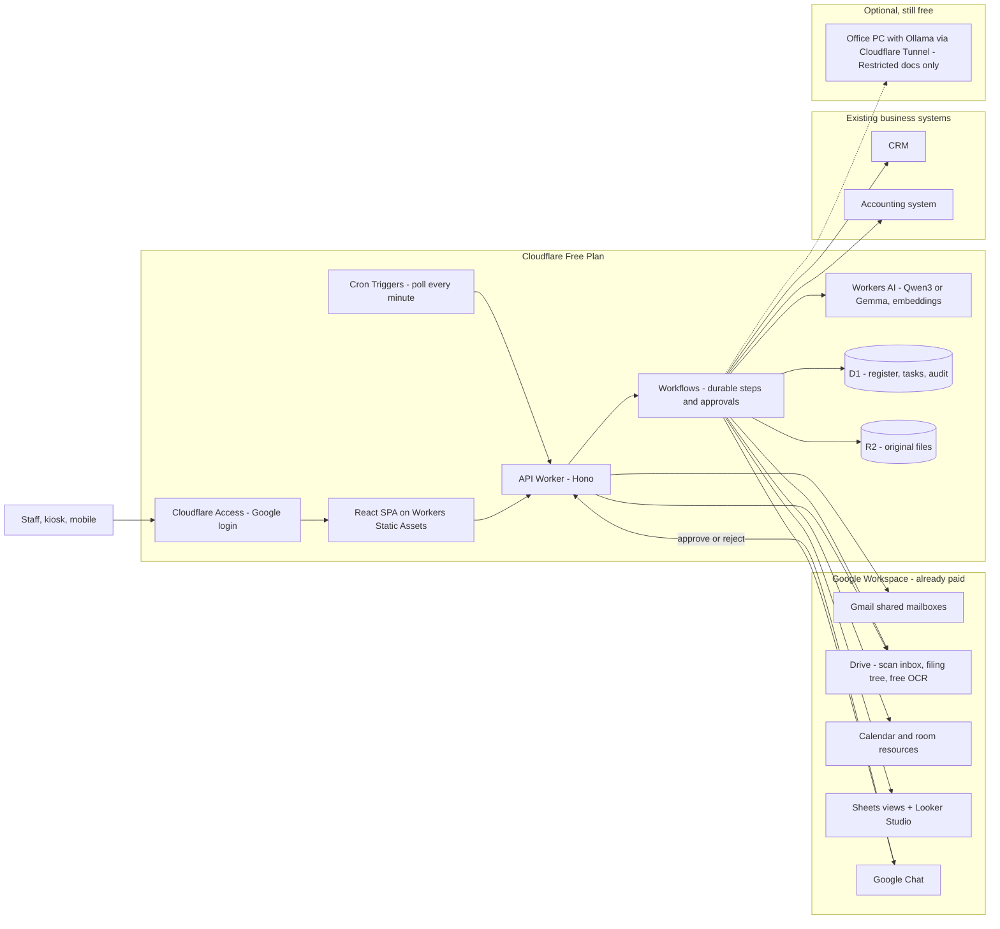
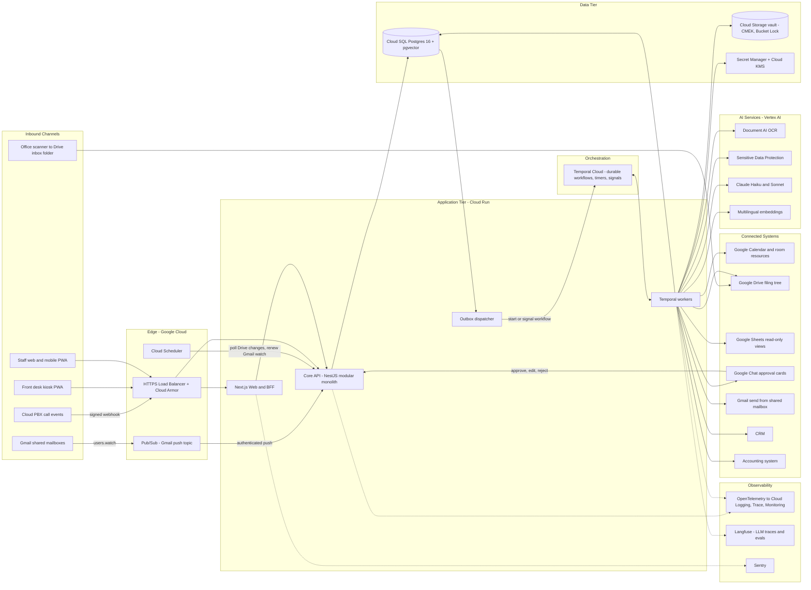
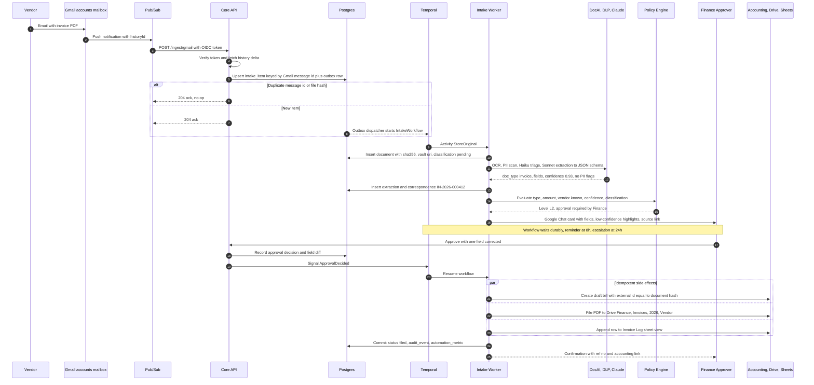
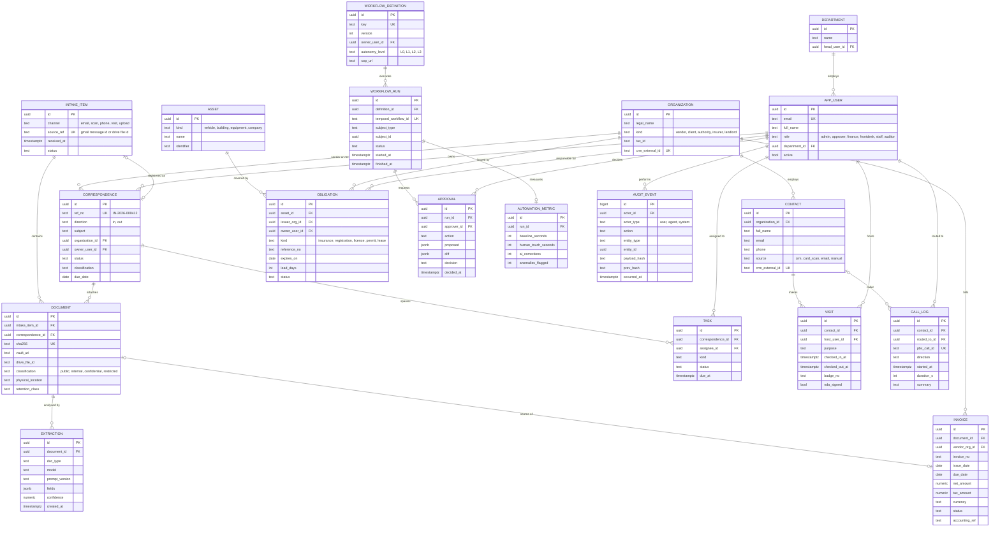

# Office OS — High-Level Architecture & Implementation Plan

> An AI-driven operating system for the office. It takes in everything that arrives (email, scans, calls, visits), records it once, routes it to the right person and follows it up. A human owns every rule, every exception and every item that leaves the office.

---

## 1. Executive Summary & Problem Breakdown

### Core Value Proposition
Office information arrives through **four channels** (email, phone, paper, walk-ins) and ends up in **six or more separate places** (inboxes, calendars, spreadsheets, Drive, CRM, filing cabinets). Today a person moves each item between them by hand. That costs hours, loses items and causes errors such as missed renewals, duplicate invoices and unanswered letters.

Office OS replaces this with **one intake pipeline, one register and one approval inbox**:

1. **Capture once.** Every inbound item gets a reference number in an immutable register within minutes.
2. **Understand.** AI classifies the item, extracts its fields and spots anomalies (duplicates, VAT mismatches, expiring licences).
3. **Route and follow up.** Durable workflows assign an owner, chase deadlines and escalate.
4. **Propagate.** Data flows to Gmail, Calendar, Drive, Sheets, the CRM and the accounting system without anyone re-typing it.
5. **Govern.** Each workflow step runs at an explicit **autonomy level**. Anything external goes through a human check. Every action is audited and measured (hours saved, errors caught).

### Key Constraints & Quality Attributes

| Attribute | Target | Notes |
|---|---|---|
| **Availability** | 99.5% in business hours, 99.0% overall | This is an office tool, not a consumer platform. No 24/7 on-call. |
| **Intake latency** | Raw registration < 30 s; AI-classified and routed p95 < 2 min | Measured from Gmail push or Drive scan detection |
| **Front-desk latency** | Kiosk check-in flow < 45 s; host notified < 10 s | |
| **API performance** | p95 < 300 ms for reads, < 800 ms for writes | Excludes AI calls, which run async |
| **Scale envelope** | ≤ 50 staff, 10k documents/month, bursts of 500/hour | Designed for 10× headroom with no architectural change |
| **Durability** | RPO ≤ 5 min, RTO ≤ 4 h, **zero lost intake items** | At-least-once ingest plus idempotent processing |
| **Accuracy** | ≥ 98% key-field accuracy after human check; ≥ 95% raw AI accuracy before a step can go autonomous | Measured continuously against human corrections |
| **Compliance** | GDPR-equivalent / local PDPL; data residency; retention schedules; full audit trail of AI actions | Contracts and claims are **Restricted** class |
| **Security** | OWASP ASVS L2; SSO + enforced 2SV; least privilege; no long-lived keys | |
| **Budget** | **$0/month** (Zero-Budget Edition, §2). Enterprise Edition (≈ $630–1,050/month) only once the savings justify it. | The only optional spend is a domain (~$10/year) |

### Key Assumptions (validate in Phase 0)
- The company uses **Google Workspace** (Business Standard or higher) with shared mailboxes or Google Groups (e.g., `info@`, `accounts@`).
- **UTC+3 / Middle East jurisdiction** is assumed. Bilingual **Arabic/English** documents and RTL UI are required. Confirm the governing data-protection law and residency rules.
- There is an existing **CRM** and **accounting system** (e.g., HubSpot/Zoho/Salesforce and Xero/QuickBooks/Zoho Books/Odoo), each with a usable REST API.
- There is a networked **multifunction scanner** that can scan to email or Drive.
- The phone system is a **cloud PBX** with call-event webhooks. If it is not, the call log falls back to quick-entry.
- One operations lead (the system owner) and a part-time developer, with Claude Code as the force multiplier.

### Scope Boundaries

| In scope — MVP (v1) | Out of scope — v1 (roadmap) |
|---|---|
| Unified intake: Gmail shared mailboxes, scan-to-Drive folder, manual/mobile upload | AI voice receptionist answering calls |
| Self-updating **correspondence register** (in/out) with gapless reference numbers and physical file locations | Supplies par-level auto-reorder (v1.1) |
| **Invoice & receipt pipeline**: read → log → file → draft bill in accounting | Petty cash, rent, municipality tax, utilities tracking (v1.1, reuses the invoice pipeline) |
| **Renewals tracker**: insurance, vehicle/building/equipment registrations, licences, official documents | Creditor statement reconciliation, overdue-payment chasers (v1.2) |
| Front desk: **visitor check-in kiosk**, **call log**, **meeting-room booking** (on Google Calendar) | Travel booking and visa document packs (v1.3; drafting assist only in v1) |
| Contact master + **CRM sync** + business-card scanning | Automated IT account provisioning/closure (checklist only in v1) |
| **Drafting studio**: AI first drafts of letters with mandatory approval before sending | E-signature, native mobile apps, multi-company tenancy |
| **Approval inbox**, autonomy policy engine, audit log, change log | **Any payment execution by AI — permanently out of scope** |
| Metrics dashboard + auto-drafted **monthly management report** | |

---

## 2. Technology Stack Recommendation & Rationale

**Guiding decision:** use **TypeScript end to end on Google Cloud**, with **Postgres as the system of record** and **Temporal for durable, human-in-the-loop workflows**. Google Workspace is where people already work, so the platform lives next to it and treats it as both a channel and a projection layer. It is not the database.

> [!IMPORTANT]
> **Two editions.** The tables below describe the **Enterprise Edition**, the target architecture once there is budget. **Start with the [Zero-Budget Edition](#zero-budget-edition--0month-recommended-starting-point)**. It keeps the same design principles (single system of record, durable workflows, autonomy levels, audit log) but runs on free tiers.

### Frontend / Client Tier

| Choice | Rationale |
|---|---|
| **Next.js (App Router, RSC)**, one codebase serving the **staff web app** and an installable **PWA** for the kiosk and mobile | The kiosk (iPad in Guided Access), mobile receipt capture and desktop register share components and auth. A PWA avoids app-store overhead for ≤ 50 users. |
| **TanStack Query** for server state; **Zustand** only for kiosk flow state | Most state is server state (register, approvals). A global store would duplicate it. |
| **React Hook Form + Zod**, with schemas shared from a `packages/schemas` workspace | One Zod schema validates the LLM's structured output, the API payload and the human review form. When the AI is corrected, the edit maps 1:1 to schema fields. |
| **Tailwind CSS + shadcn/ui (Radix)**, **next-intl** for Arabic/English with logical CSS properties for RTL | Accessible primitives that are quick to build. RTL is a first-class requirement, not a retrofit. |
| **Server-Sent Events** for live register and approval updates | One-way server→client push is all that's needed. SSE is simpler than WebSockets on Cloud Run and works through proxies. |

### Backend / API Tier

| Choice | Rationale |
|---|---|
| **Node.js 22 LTS + TypeScript**, **NestJS** modular monolith | NestJS modules map cleanly to bounded contexts, and DI plus Guards give consistent RBAC. Python was rejected because there is no custom ML: OCR and LLMs are API calls, and one language across UI, API and workers cuts cognitive load for a tiny team. |
| **REST + OpenAPI 3.1** with a generated typed client; **signed webhooks** inbound | There are few clients and they are all first-party, so GraphQL's flexibility isn't needed. OpenAPI also gives contract tests against CRM and accounting adapters. |
| **Temporal (TypeScript SDK)** for all workflows | Most workflows here wait for something: an approval, a renewal date 60 days out, a vendor reply. Temporal provides durable timers, signals (approve/reject), per-activity retries and a full replayable history, which is an audit asset. Queues plus cron (BullMQ, pg-boss) would mean hand-building all of this. |
| **Drizzle ORM** + SQL migrations | Stays close to SQL, works well with Postgres Row-Level Security and session variables, and produces reviewable migrations. |
| **Transactional outbox** (Postgres table → dispatcher → Temporal) | A DB commit and a workflow start never diverge: no ghost workflows and no orphan records. |

### Data Tier

| Choice | Rationale |
|---|---|
| **Cloud SQL for PostgreSQL 16 (HA, private IP, CMEK)** as the **primary OLTP store** | Handles relational integrity (register, invoices, obligations), JSONB for variable extraction payloads, **RLS** for confidentiality enforcement and PITR backups in one engine. |
| **pgvector + Postgres full-text search** (`simple` + `arabic` configs) | Supports semantic search ("the municipality letter about the water meter") and keyword search at 10k docs/month without running a separate vector DB or search cluster. |
| **Vertex AI multilingual embeddings** | Handles Arabic/English, stays in GCP and is billed alongside everything else. |
| **Cloud Storage (CMEK, versioning, Bucket Lock on register buckets)** as the **document vault** for originals | Drive files can be moved, edited or deleted by users. The register needs tamper-evident originals with retention locks. **Drive holds the human-browsable filing copy**. GCS holds the evidence. |
| **Cache: deliberately none in v1** | At this scale, Postgres, in-process LRU and Next.js data caching are enough. Add **Memorystore (Redis)** only when a measured need appears (e.g., cross-instance rate limiting or a hot dashboard). Fewer moving parts means fewer 2 a.m. failures. |
| **Reporting**: Postgres reporting views / materialized views → **Looker Studio** | Free and native to Workspace, and management already lives there. Promote to BigQuery only if analytics outgrow OLTP. |

### Infrastructure & DevOps

| Choice | Rationale |
|---|---|
| **Google Cloud, single in-jurisdiction region** (e.g., `me-central2` Dammam or `me-central1` Doha, set by legal) | Gives the lowest-friction Workspace integration (Pub/Sub for Gmail push, keyless domain-wide delegation, Document AI, Claude on Vertex) under one IAM, billing and audit plane. |
| **Cloud Run** for `web`, `api`, `worker` (min-instances = 1, CPU always allocated) and self-hosted `langfuse` | Serverless containers with no Kubernetes to operate. GKE was rejected as unjustified overhead for this load. |
| **Temporal Cloud**, with a **client-side payload encryption codec (Cloud KMS key)** | No Temporal cluster to run. Temporal Cloud only ever sees ciphertext payloads, which settles the data-residency concern for workflow state. Self-host on GKE only if legal forbids even encrypted payloads offshore. |
| **Terraform** (GCS remote state) for all infra; separate `prod`, `staging` and `security` projects | The environment can be rebuilt from Git, and every infra change is in the change log by construction. |
| **GitHub Actions + Workload Identity Federation**, Artifact Registry, Cloud Run revisions with traffic splitting | No JSON service-account keys anywhere. Instant rollback by shifting traffic to the previous revision. |
| CI gates: typecheck, ESLint (+ `dependency-cruiser` module boundaries), Vitest, Playwright, **LLM eval suite**, Semgrep, gitleaks, Trivy | Prompt and model changes are regression-tested like code. |
| **Observability**: OpenTelemetry → Cloud Logging/Trace/Monitoring; **Sentry** (frontend + API); **Langfuse** (LLM traces, prompt versions, eval scores) | Native GCP telemetry keeps cost near zero. Langfuse is self-hosted so prompts and document content never reach a third-party SaaS. |
| **Dev loop**: Docker Compose (Postgres + Temporal dev server), **Claude Code** with a repo `CLAUDE.md` + hooks running tests | Builds on the "build with AI, improve weekly" mandate. App builders (e.g., AppSheet) are allowed **only for throwaway Phase 0 prototypes**, never as a system of record. |

### Third-Party Services

| Need | Choice | Rationale |
|---|---|---|
| **Auth** | **Google Workspace OIDC** (restricted by the `hd` claim) | Users already exist with 2SV enforced. Suspending someone in Workspace instantly revokes access, so offboarding is free. No Auth0/Clerk cost or extra identity silo. |
| **AI — reasoning & extraction** | **Claude Sonnet** (latest GA) via **Vertex AI** | Strong at structured extraction with tool/JSON-schema output, Arabic/English and careful letter drafting. Vertex keeps traffic in GCP IAM/VPC-SC with no training on customer data. |
| **AI — triage** | **Claude Haiku** via Vertex AI | 5–10× cheaper for classification and routing, which is about 70% of calls. |
| **OCR** | **Document AI Enterprise OCR** | Gives a reliable text layer and layout for low-quality scans and Arabic script. It is cheaper and more deterministic than pure vision-LLM OCR, and the LLM then reasons over clean text. |
| **PII detection** | **Sensitive Data Protection (Cloud DLP)** | Classifies and redacts IDs, IBANs and passport numbers before content reaches an LLM or a log. |
| **Speech** | **Speech-to-Text v2 (Chirp)** | Call summaries, only where recordings exist **and** consent is captured. |
| **Email (transactional + outbound letters)** | **Gmail API** from shared mailboxes | Sent mail lands in the real "Sent" folder and is covered by Workspace Vault retention and eDiscovery. SendGrid would split the correspondence record. |
| **Internal notifications & approvals** | **Google Chat API** (interactive cards) | Approve/edit/reject where people already are, with a deep link to the full review screen. |
| **Payments** | **None.** Integrate with the accounting system via an adapter. | AI prepares **draft** bills only. Posting and paying stay in the accounting system with humans (L0). |
| **CRM / Accounting** | Adapters behind `CrmPort` / `AccountingPort` interfaces | The actual vendors are unknown, and the adapter pattern isolates API churn. |

### Enterprise Edition — Indicative Monthly Run Cost (later; MVP volume, ~4k documents/month)

| Item | Estimate (USD) |
|---|---|
| Cloud SQL Postgres HA (2 vCPU / 8 GB) | 250–300 |
| Cloud Run (web, api, worker, langfuse) | 80–150 |
| Temporal Cloud (Essentials) | 100–200 |
| Claude on Vertex (Haiku triage + Sonnet extraction/drafting) | 100–250 |
| LB + Cloud Armor, GCS, KMS, Secret Manager, Pub/Sub, Document AI, DLP | 70–120 |
| Sentry Team | ~26 |
| **Total** | **~$630–1,050** |

> Validate against current list prices in Phase 0. LLM cost is the main variable and is capped by daily budget alerts.

### Zero-Budget Edition — $0/month (recommended starting point)

**Why it can be free:** you already pay for **Google Workspace**. Gmail, Drive, Calendar, Sheets and Chat APIs, Drive's built-in OCR and Looker Studio cost nothing extra. Everything else runs on **Cloudflare's Workers Free plan**, which includes hosting, a SQL database, file storage, durable workflows with human-approval waits, AI inference and staff login for up to 50 users.

#### Component swap

| Enterprise component | Free replacement | Free allowance (verify in dashboard) | Fits because |
|---|---|---|---|
| Cloud Run (web + API) | **Workers + Workers Static Assets**: React SPA (Vite) + Hono API Worker | 100k requests/day; static asset requests free | A 50-person office generates a few thousand requests a day. A static SPA avoids server-side rendering, which would hit the 10 ms CPU limit. |
| Temporal Cloud | **Cloudflare Workflows** (`step.do`, `step.sleep`, `step.waitForEvent`) | Included on Free; waiting/sleeping instances don't count toward concurrency | Same durable approve/reject and wait-for-days pattern. Instance history is kept only 3 days on Free, so the **audit trail lives in D1**, not in workflow history. |
| Cloud SQL Postgres | **D1** (SQLite) | 500 MB per database, 5M rows read/day, 100k rows written/day, 7-day Time Travel restore | The register, tasks, obligations and audit data are small text records; 500 MB holds hundreds of thousands of rows. RLS isn't available, so access control is enforced in the API layer. |
| GCS vault | **R2** (originals) + **Drive** (filing copy, already paid) | 10 GB storage, no egress fees | About 50k PDFs at ~200 KB each. R2 may require a card on file even within the free tier. If so, keep originals in a locked Drive shared drive instead. |
| Pub/Sub Gmail push | **Cron Triggers** polling Gmail `history.list` and Drive `changes.list` every minute | ~1,440 polls/day per trigger | Removes the GCP billing requirement. Intake latency becomes p95 < 3 min instead of < 2 min. |
| Document AI OCR | **Drive API OCR** (convert scan → Google Doc with `ocrLanguage` = `ar`/`en`) + scanner's built-in *searchable PDF* mode | Free within Workspace | Arabic is supported, and the data never leaves Workspace. |
| Claude Sonnet/Haiku on Vertex | **Workers AI**: `@cf/qwen/qwen3-30b-a3b-fp8` or `@cf/google/gemma-4-26b-a4b-it` for extraction and triage; multilingual embeddings for search | **10,000 neurons/day** ≈ **240–340 document extractions/day** (at ~3k input + 500 output tokens per document) | Covers typical small-office volume. Cloudflare doesn't train on your inference data. |
| Google OIDC + sessions | **Cloudflare Access** (Zero Trust Free) with Google Workspace as the identity provider | Up to 50 users | SSO plus 2SV in front of the app, with no auth code to write. The app reads the verified Access JWT. |
| DLP | Regex + checksum detectors in the API (IDs, IBANs, passport numbers), plus an LLM classification prompt | — | Good enough for routing and redaction at this scale. |
| Cloud Logging / Trace, Sentry Team, Langfuse | **Workers Logs** + **Sentry Developer (free)** + LLM prompt/version/score rows stored in D1 | Free tiers | A daily cron posts the health digest to Google Chat. |
| Looker Studio on Postgres | Nightly metrics export to a **Google Sheet** → **Looker Studio** | Free | Management dashboard and monthly report source. |
| GitHub Actions + Terraform | **GitHub Free** (or Workers Builds) + `wrangler deploy`; resources declared in `wrangler.jsonc` | 2,000 CI minutes/month | Infrastructure stays in Git. |

#### Zero-Budget Edition — System Flow

#### Monthly cost

| Item | Cost |
|---|---|
| Cloudflare Workers Free (Workers, Static Assets, Workflows, D1, R2, Workers AI, Cron) | $0 |
| Cloudflare Access (≤ 50 users) | $0 |
| Google APIs, Drive OCR, Chat, Looker Studio (existing Workspace) | $0 |
| Sentry Developer, GitHub Free | $0 |
| Custom domain (optional; makes Access setup straightforward) | ~$1 (≈ $10/year) |
| **Total** | **$0 – $1/month** |

#### Free-tier rules the design must follow

1. **10 ms CPU per invocation.**
   - Never parse PDFs or images inside a Worker. OCR is delegated to Drive, and LLM calls are network I/O, which doesn't count as CPU.
   - Stream files R2 ↔ Drive without transforming them.
   - Keep each Workflow step small.
2. **50 external subrequests per invocation.** Batch Google API calls (Sheets `batchUpdate`) and split work across Workflow steps.
3. **Daily AI cap of 10k neurons, reset at 00:00 UTC (03:00 local).**
   - When the cap is hit, intake **still registers and routes the item**.
   - The AI step sleeps until the reset, so items queue rather than fail.
   - A D1 counter tracks neuron spend and shows it in the morning digest.
4. **Renewal reminders run on a daily cron sweep** over the `obligation` table, not on months-long `step.sleep` calls. This is more robust and visible.
5. **Workflow history is kept 3 days.** Every decision, approval and AI output is written to D1 `audit_event` / `approval` tables, which form the permanent record.
6. **Never use free consumer AI APIs** (e.g., Gemini API free tier) for office documents. Unpaid tiers may use your inputs to improve the vendor's products, which is unacceptable for contracts and claims.

#### Trade-offs to accept

| Trade-off | Consequence | Mitigation |
|---|---|---|
| Open-weight models instead of Claude Sonnet | Lower extraction accuracy on messy Arabic scans; more human corrections | Phase 0 spike on 100 real documents. Keep invoices at L2 longer. Use the paid escape hatch below for hard documents only. |
| No in-region data residency on the free plan | Workers AI may process data outside your country | **Restricted documents (contracts, claims) are not sent to cloud AI.** Register them from metadata entered by a person, or use the optional local Ollama box. |
| No SLA; free-tier terms can change | Possible disruption | Portable code (Hono and SQL work elsewhere), nightly D1 export to R2/Drive, documented manual fallback in every SOP |
| D1 has no row-level security | Authorization relies on the API layer | One central policy module, tests for every role × classification combination, Restricted records also stored in a separate D1 database |

#### Optional: fully private local AI ($0 if you have a spare PC)

If contracts and claims must never leave the office:
- Run **Ollama** (e.g., Qwen3 8B or Gemma) on an office PC with ≥ 16 GB RAM (a GPU helps a lot).
- Expose it only to your Worker through **Cloudflare Tunnel + Access service tokens** (free). No open ports.
- The policy engine routes **only Restricted documents** to it. Everything else uses Workers AI.

#### Upgrade ladder (pay only when the hours saved prove the value)

| Step | Cost | What it unlocks |
|---|---|---|
| 0. Zero-Budget Edition | **$0** | Everything above |
| 1. Workers Paid | **$5/month** | Much higher CPU limits, 30-day workflow history, AI usage beyond 10k neurons/day at $0.011 per 1k neurons (≈ $0.0003–0.0005 per extra document) |
| 2. Claude Haiku for hard documents only, through AI Gateway (free) with a hard spend cap | **≈ $0.005/document**, e.g. ~$5 per 1,000 hard docs | Frontier-quality extraction where the open models score low confidence |
| 3. Enterprise Edition (above) | ≈ $630–1,050/month | In-region residency, Postgres RLS, Temporal, SLAs. Justified only when the monthly report shows the savings. |

---

## 3. System Architecture & High-Level Design

### Architectural Style
A **modular monolith with event-driven, durable workflows**, a **human-in-the-loop policy layer** and **Google Workspace treated as both channel and projection**.

- **One deployable API + one worker image** sharing a domain codebase. Module boundaries are enforced in CI (no cross-module table access; modules talk through public interfaces and outbox events). Microservices would multiply ops cost for a 1–2 person team with no scaling benefit at 50 users.
- **Temporal** owns anything long-running, retried or waiting on a human.
- **"Enter once, propagate everywhere"** means each data element has **one system of record**. Everything else is a projection:

| Data | System of record | Projections | Sync direction |
|---|---|---|---|
| Contacts & organisations | **CRM** | Platform contact master | CRM → Platform (webhook/poll). Platform creates new contacts *via* the CRM API. |
| Correspondence register | **Platform (Postgres)** | Sheets "Register" view, Drive filing tree | One-way out |
| Calendars & rooms | **Google Calendar** | Platform reads free/busy and resources | Calendar is authoritative |
| Financial postings | **Accounting system** | Platform holds intake, extraction and status | Draft bill out, status back |
| Obligations / renewals | **Platform** | Calendar reminders, Sheets view | One-way out |
| Document originals | **GCS vault** | Drive filing copy | One-way out |

> **Google Sheets are read-only views, never inputs.** Two-way spreadsheet sync is the most common way office automations quietly corrupt data.

### Autonomy Policy (what AI does alone vs. with approval vs. never)

| Level | Meaning |
|---|---|
| **L0** | Human only. AI is not involved. |
| **L1** | AI suggests; a human performs the action. |
| **L2** | AI prepares; a human **approves before** any effect. |
| **L3** | AI executes; a human **audits after** (weekly random sample ≥ 5%). |

| Workflow step | Default level | Promotion rule |
|---|---|---|
| Register inbound item, assign ref no, file original | **L3** | — |
| Classify and route internally to owner | L3 if confidence ≥ 0.85, else L1 triage queue | — |
| Extract invoice/receipt fields → log | **L2** | → L3 for known vendors under an amount threshold after 200 runs at ≥ 98% accuracy, with owner sign-off |
| Create **draft** bill in accounting | **L2** | Stays L2 |
| Post bill / pay / disburse petty cash | **L0** | Never automated |
| **Anything sent outside the office** (email, letter, CRM-triggered message) | **L2 always** | Never promoted |
| Internal renewal reminders and escalations | **L3** | — |
| Contacting insurers or authorities about renewals | **L2** | — |
| Visitor check-in, host notification, badge | **L3** | — |
| Create CRM contact (no duplicate candidate) / merge contacts | L3 / **L2** | — |
| **Restricted** docs (contracts, claims): routing outside owning department | **L2** | Never promoted |
| IT account closure for leavers | **L1** (checklist) | Revisit in v1.3 |

**Automatic demotion as a circuit breaker:** if a step's human-correction rate exceeds **10% over the last 50 runs**, the policy engine drops it one level and alerts the owner. Every promotion or demotion is recorded in the change log.

### System Flow Diagram

### Core Subsystems (Bounded-Context Modules)

- **Identity & Access**: Google OIDC login, sessions, roles, department/classification attributes, Postgres RLS session context, agent principals (`agent:intake`, `agent:drafting`).
- **Intake**: channel adapters (Gmail push + `history.list` delta sync, Drive change polling, upload, PBX webhook, kiosk). Normalises everything into an `IntakeItem`, dedupes by source ID and SHA-256, and writes to the vault. It must never lose an item.
- **Document Intelligence**: OCR → DLP classification → Haiku triage → Sonnet schema-bound extraction → embeddings. Holds the **prompt registry** (versioned prompts and JSON Schemas per document type) and confidence scoring.
- **Registry**: correspondence register (in/out), **gapless reference numbering** (`IN-2026-000412`, `OUT-2026-000088`) via a locked counter row, physical location tracking (cabinet/shelf/box) with QR labels for paper files, retention classes.
- **Routing & Tasks**: rule engine (sender/org, doc type, keywords, department) plus AI suggestion, assignment, SLAs, follow-up timers, escalation chains.
- **Policy & Approvals**: autonomy-level evaluation, approval inbox, Google Chat cards, capture of human edits as field-level diffs (these feed accuracy metrics and eval datasets), auto-demotion.
- **Finance Ops**: invoices and receipts (duplicate detection on vendor + number + amount + hash, VAT arithmetic checks, PO matching where POs exist), draft bills to accounting. Later: petty cash, utilities, rent, reconciliation.
- **Front Desk**: visitor pre-registration from Calendar invites, kiosk check-in/out, NDA capture, badge label printing, host notification; call log; room booking on Calendar resource calendars plus room-door display.
- **Obligations & Assets**: asset registry (vehicles, buildings, equipment, company licences) and obligations (insurance, registrations, licences, permits, leases) with reminder ladders at 60/30/14/7 days and escalation to management.
- **Contacts & CRM Sync**: contact master, business-card scan → contact, fuzzy dedupe, CRM adapter.
- **Drafting Studio**: Google Docs templates, Claude first drafts and proofreading, mandatory L2 approval, outgoing reference number stamped on the PDF, send via Gmail, auto-register outbound.
- **Integration Hub**: Google, CRM and accounting adapters. Each has a **dedicated Temporal task queue** with concurrency caps (quota protection), idempotency keys and contract tests.
- **Insights**: automation metrics, Looker Studio datasets, auto-drafted monthly management report (Google Doc, human-reviewed).
- **Platform**: hash-chained audit log, change log, configuration, notifications, morning health digest.

---

## 4. UML & Structural Diagrams

### 4.1 Critical Path — Inbound Invoice by Email (`sequenceDiagram`)

### 4.2 Data Model (`erDiagram`)

**Measurement model (feeds the monthly report):**
- **Hours saved** = Σ (`baseline_seconds` − `human_touch_seconds`). Baselines come from the Phase 0 time study. Touch time is measured in the UI, from when a review screen opens to when the decision is made.
- **Errors caught** are reported as two honest numbers:
  1. **Anomalies caught by the system**: duplicates, VAT/arithmetic mismatches, expiring obligations, unknown vendors.
  2. **AI errors caught by the human check** (`ai_corrections`). This is the AI error rate and drives promotion and demotion.

---

## 5. Security, Reliability & Operational Strategy

### Authentication & Authorization
- **Identity provider:** Google Workspace OIDC, restricted to the company domain (`hd` claim), with 2SV enforced at the Workspace level.
- **Sessions:** server-side opaque session ID in an `HttpOnly; Secure; SameSite=Lax` cookie stored in Postgres. **No JWTs in the browser.** 8 h absolute lifetime; 30 min idle for Finance and Restricted views. Revoked when the Workspace account is suspended (checked hourly via the Admin SDK).
- **Kiosk:** a device-bound credential with a `kiosk` role that can only create visits and read same-day expected visitor first names. No browsing of the directory or register.
- **RBAC:** `admin`, `approver`, `finance`, `frontdesk`, `staff`, `auditor` (read-only, including the audit log).
- **ABAC:** `classification × department × ownership`, enforced twice: in the NestJS policy guard **and** in **Postgres RLS** (`SET LOCAL app.user_id / app.roles` per transaction). Restricted rows are invisible at the database level to anyone outside their department.
- **AI agents are principals:** each agent (`agent:intake`, `agent:drafting`) has least-privilege permissions and every tool call is authorised like a user's. Agents have **propose-only** tools for external effects; send, post and merge actions exist only behind an `Approval` signal.
- **Google API access:** **keyless domain-wide delegation** (IAM `signJwt` from the worker's service account; no key files). Minimal scopes, an impersonation allow-list (shared mailboxes plus specific calendars) and a separate GCP project. Alerts fire on any new scope grant.
- **Service-to-service:** Cloud Run IAM with OIDC ID tokens. Pub/Sub push is verified by token audience. PBX webhooks are verified by HMAC signature plus timestamp to prevent replay.

### Prompt-Injection Defence (critical for an inbox-reading system)
Inbound emails and documents are **untrusted input**.
1. Extraction calls have **no tools**. Output must validate against the Zod/JSON schema or it is rejected.
2. Document content is delimited and labelled as data. System prompts instruct the model to ignore embedded instructions.
3. Downstream actions come only from **enumerated values** (route targets, doc types), never free-text commands.
4. External effects always pass through L2.
5. A red-team corpus of 50+ adversarial documents runs in CI on every prompt change.

### Data Protection
- **In transit:** TLS 1.2+ everywhere, HSTS, private IP for Cloud SQL, Serverless VPC connector.
- **At rest:** CMEK (Cloud KMS) for Cloud SQL, GCS and the Temporal payload codec. **Field-level envelope encryption** for passport/national ID numbers (visa support) and bank details.
- **Classification gate:** DLP plus rules label every document as Public, Internal, Confidential or **Restricted** (contracts, claims, HR, IDs).
  - Restricted content goes to the LLM only through the in-region/approved Vertex endpoint with zero-retention terms confirmed.
  - If no compliant endpoint exists, Restricted content is **DLP-redacted** first, or processed metadata-only (title, parties, dates) until legal signs off.
- **Secrets:** Secret Manager, with CRM/accounting OAuth refresh tokens stored encrypted. Automatic rotation where providers support it. gitleaks in CI.
- **PII minimisation:** visitor records are purged after 90 days (configurable). Call recordings require a consent prompt and are kept for 30 days. Logs carry IDs, never content (a redaction middleware enforces this).
- **Retention & integrity:**
  - Register and financial documents sit in Bucket-Locked GCS according to their retention class.
  - The audit log is hash-chained (`prev_hash`) and exported daily to a separate-project, write-once bucket.
  - A data subject erasure workflow (L2) covers non-statutory records.
- **Backups:** Cloud SQL PITR (7 days) plus a nightly export to an isolated backup project (ransomware blast-radius isolation). GCS versioning and soft delete are enabled.

### Resilience & Scalability
- **Idempotency everywhere:** every external write carries a deterministic key: accounting `external_id` = document hash, Drive `appProperties.intakeId`, Sheets row check by ref no, Gmail `Message-ID`. Retries can never double-file or double-bill.
- **Retries:** Temporal activity policies use exponential backoff with jitter (initial 2 s, ×2, max 10 min, max 20 attempts). 4xx validation errors are marked non-retryable and go straight to the exception queue.
- **Circuit breakers:**
  - If the AI error rate exceeds 20% over 5 minutes, AI-dependent workflows park in `awaiting_ai`. Items are still **registered and routed to manual triage**, so the office never stops.
  - Haiku serves as the fallback for triage when Sonnet is unavailable.
- **Quota protection:** a per-integration Temporal task queue with a `maxConcurrentActivityTaskExecutions` cap (e.g., Gmail 5, Drive 5, CRM 3, accounting 2) respects Google and vendor rate limits by design.
- **Missed-event safety net:** Gmail `watch` is renewed daily (it expires after 7 days). A **15-minute `history.list` reconciliation sweep** catches dropped pushes. Drive scan folders are polled with `changes.list` every 60 s rather than relying on expiring push channels.
- **Rate limiting (inbound):** Cloud Armor per-IP limits on webhooks and the kiosk, plus a per-user token bucket in the API (in-instance; promote to Redis if instances exceed ~5).
- **Caching:** Next.js data cache for reference data, 60 s cache for Calendar free/busy, dashboard materialized views refreshed every 5 minutes. No distributed cache in v1.
- **Horizontal scaling & limits:** API scales on Cloud Run from 1 to 10 instances and workers from 1 to 5. The practical ceiling is Postgres (scale vertically, then add a read replica for reporting) and external quotas (Gmail per-user quota units, Document AI pages/min, Vertex Claude regional TPM). The current design has about 50× headroom over expected load.

### Observability
- **Business metrics:**
  - Items ingested per channel and auto-registered %.
  - Approval latency (p50/p95) and backlog.
  - AI correction rate per workflow step.
  - Hours saved and anomalies caught.
  - Obligations due within 30 days without owner acknowledgement.
- **Technical metrics:**
  - API latency and error rate.
  - Temporal workflow failures and schedule-to-start latency (backlog signal).
  - Integration error rates.
  - LLM tokens, cost per day and cost per document.
- **Structured logs:** JSON with `trace_id`, `workflow_id`, `intake_id`, `actor` and `module`, with no document content or PII.
- **Distributed tracing:** OpenTelemetry from Next.js → API → Temporal (OTel interceptors) → adapters → Vertex. Langfuse traces link to the same `trace_id`.
- **Daily operations:** an automated **08:00 morning health digest** in the Ops Chat space covering yesterday's volumes, failures, items stuck more than 4 h, pending approvals, upcoming expiries and AI spend.
- **Change log:** every workflow, prompt, rule or autonomy change ships as a PR with a `workflow_definition` version bump and a CHANGELOG entry.

| Alert | Trigger | Channel |
|---|---|---|
| Ingest stalled | No Gmail/Drive items for > 2 h in business hours, or watch renewal failed | Ops Chat + email |
| Workflow failures | > 2% failed runs over 1 h, or any run stuck in retry > 1 h | Ops Chat |
| Approval SLA breach | Approval pending > 24 h | Approver + escalation manager |
| AI quality drift | Correction rate > 10% over 50 runs (auto-demotes) | Workflow owner |
| AI spend | Daily LLM cost > 150% of 7-day average or above the hard cap | Ops lead |
| Obligation risk | Expires in < 14 days and is unacknowledged | Owner + management |
| Platform health | DB CPU > 80% for 15 min, storage > 80%, backup/export failure | Ops lead |

---

## 6. Initial Design Cycle & Phased Implementation Plan

Cadence: **2-week sprints**. Each workflow goes through the same loop: **shadow mode** (AI runs in parallel and humans still do the work), then **L2**, then promotion based on evidence. **One workflow is improved every week** from the correction diffs.

### Phase 0 — Technical Discovery & PoC (Days 1–5)

| Day | Activity |
|---|---|
| 1–2 | **Workflow mapping with management.** Inventory every operation in the brief. For each one, record volume/month, minutes/unit (a timed sample of 10 units gives the **baseline**), error rate and error cost. Rank by **Score = (hours/month × error-cost weight × automation feasibility) ÷ confidentiality risk**. Confirm systems in use: CRM, accounting, PBX, scanner, Workspace edition. |
| 2–4 | **Technical spikes** (below) |
| 5 | Go/no-go memo, ranked backlog, ADRs, API and event contracts signed off |

**Spikes and risks to validate:**
1. **Extraction accuracy:** Document AI OCR + Claude on **100 historical invoices and receipts plus 50 scanned letters** (Arabic/English, including poor scans). Exit criterion: ≥ 95% key-field accuracy (vendor, number, date, total, tax).
2. **Gmail push:** `users.watch` → Pub/Sub → endpoint → `history.list` delta on a test shared mailbox, using keyless domain-wide delegation.
3. **CRM and accounting APIs:** confirm contact upsert, draft bill creation with `external_id`, webhooks and rate limits.
4. **Legal / residency:** confirm the Claude-on-Vertex region, zero-retention terms and the governing law. Decide how Restricted documents are handled.
5. **Temporal Cloud + KMS payload codec:** a hello-world approval workflow with a signal and a timer.

**Contracts:**
- OpenAPI for the core API.
- JSON Schema per document type (invoice, receipt, letter, business card, insurance policy, licence).
- Event catalogue: `IntakeReceived`, `DocumentClassified`, `CorrespondenceRegistered`, `ApprovalRequested`, `ApprovalDecided`, `ObligationDue`, `VisitorArrived`.

**ADRs:**
- ADR-001 Modular monolith
- ADR-002 Temporal for workflows
- ADR-003 Postgres as system of record, Sheets as views
- ADR-004 Claude via Vertex + Document AI
- ADR-005 Autonomy levels

### Phase 1 — Minimum Viable Architecture / Foundation (Sprints 1–2)

**Sprint 1: Platform**
- Terraform landing zone (`prod` / `staging` / `security` projects), VPC, Cloud SQL HA with private IP, CMEK buckets, Secret Manager, Artifact Registry, Cloud Armor.
- Monorepo (pnpm + Turborepo): `apps/web`, `apps/api`, `apps/worker`, `packages/schemas`, `packages/domain`, `infra/`.
- CI/CD: GitHub Actions + WIF; quality and security gates; Cloud Run deploys with staging auto-promote and manual prod approval.
- Google OIDC login, sessions, RBAC + **RLS**, hash-chained audit log.
- Core schema: users, departments, organisations, contacts, intake, documents, correspondence, tasks, workflow definitions/runs, approvals, metrics.

**Sprint 2: Intake backbone**
- Gmail watch for **one shared mailbox**, Drive scan-folder polling, manual upload. Vault storage, SHA-256 dedupe, transactional outbox.
- `IntakeWorkflow` skeleton in Temporal. **Gapless reference-number service.**
- Correspondence register UI: list, detail, full-text search, physical location, QR label print.
- OpenTelemetry + Sentry + morning digest. Contact master import from the CRM (or the current spreadsheet).

**Exit criterion:** an email to `info@` and a scanned letter both appear in the register with a reference number in < 30 s, traced end to end. Restoring PITR to staging is proven.

### Phase 2 — Core Feature Implementation (Sprints 3–4)

**Sprint 3: Intelligence + Finance**
- Haiku triage, Sonnet schema-bound extraction, DLP classification, embeddings and semantic search.
- **Policy engine + autonomy levels**, **Approval Inbox** + Google Chat cards, edit-diff capture.
- Routing rules UI, follow-up timers and escalations.
- **Invoice & receipt pipeline:** extract, run anomaly checks, approve, draft bill in accounting, file to Drive, update the Sheets log view.
- **LLM eval harness in CI** with a golden set built from Phase 0 samples, plus the prompt-injection corpus.
- **Shadow mode starts** for intake classification and invoices.

**Sprint 4: Front desk + Obligations + Outbound**
- **Visitor kiosk:** pre-registration from Calendar invites, check-in/out, NDA, badge printing (e.g., Brother QL), host notification via Chat.
- **Call log:** PBX webhook with AI summary, or a 10-second quick-entry form with caller lookup.
- **Room booking:** booking UI and door display on Calendar resource calendars.
- **Renewals tracker:** import the existing spreadsheet, define assets and obligations, run the 60/30/14/7-day reminder ladder with escalation.
- **Drafting Studio v1:** templates, Claude draft and proofread, L2 approval, outgoing reference number, Gmail send, auto-registration.
- **Business-card scanning** → contact → CRM.

**Exit criterion:** shadow-mode comparison over ≥ 1 week shows ≥ 95% raw field accuracy on invoices and ≥ 90% correct routing. Front desk has used the kiosk and call log for 5 consecutive business days.

### Phase 3 — Hardening & MVP Launch (Sprint 5)

- **Security:**
  - OWASP ASVS L2 self-assessment and a light external pen test.
  - Prompt-injection red-team pass.
  - Audit of domain-wide delegation scopes and impersonation list.
  - RLS bypass tests, access review and secrets rotation drill.
- **Load and resilience:**
  - k6 at 10× expected peak (500 documents in 1 h plus 30 concurrent users).
  - Chaos tests: kill a worker mid-workflow, Vertex 5xx injection, accounting API outage.
  - DR drill measuring real RTO.
- **Telemetry:** Looker Studio management dashboard, alert tuning, **first auto-drafted monthly report** (hours saved, errors caught, AI accuracy trend, incidents, changes).
- **SOPs:** one per system, using a fixed template: *Purpose · Owner · Trigger · Steps · Autonomy level per step · Human checkpoints · Exceptions & escalation · Rollback/manual fallback · KPIs · Change history*. Stored in Drive and linked from `workflow_definition.sop_url`.
- **Training:** a 30-minute session per role (front desk, finance, approvers, managers), plus in-app "report a problem" feedback feeding a weekly improvement review.
- **Go-live:** cut over per workflow from shadow to L2, followed by 2 weeks of hypercare with a daily 15-minute stand-up on the digest.

### Post-MVP Roadmap (one workflow per week, ranked by Phase 0 score)
- **v1.1:** petty cash (mobile receipt capture), utilities/rent/municipality tax tracking (reuses the invoice pipeline plus obligations), supplies par-level reorder (L2 purchase orders).
- **v1.2:** creditor statement reconciliation, overdue-payment chasers (L2 emails), recurring financial reports.
- **v1.3:** travel and visa document packs, IT onboarding/offboarding orchestration via the Admin SDK (L2), evaluation of an AI phone receptionist.

### Key Risks & Mitigation Matrix

| Risk | Impact | Mitigation Strategy |
|---|---|---|
| Prompt injection in an inbound email or document triggers an unauthorised action | **Critical**: data leak or a fraudulent outbound message | Tool-less extraction; schema-validated output; propose-only agents; all external effects L2; red-team corpus in CI |
| Confidential contracts or claims processed outside the approved jurisdiction or retained by the AI vendor | **Critical**: legal/regulatory exposure | Classification gate before any AI call; in-region Vertex endpoint with zero-retention terms; DLP redaction or metadata-only fallback; legal sign-off in Phase 0 |
| Domain-wide delegation credential misuse | **Critical**: full mailbox/Drive access | Keyless `signJwt`; minimal scopes; impersonation allow-list; isolated project; alert on token use and scope changes |
| Duplicate invoice leads to double payment | **High**: direct financial loss | Hash plus (vendor, number, amount) uniqueness; draft-only accounting writes with `external_id`; AI never posts or pays (L0) |
| Poor scan quality or handwriting degrades extraction | Medium: rework, lost trust | Scanner standard of 300 dpi with auto-deskew; low-confidence fields highlighted for review; golden-set evals; auto-demotion |
| Approvers rubber-stamp AI output | **High**: errors pass the human check | Side-by-side source view; low-confidence highlighting; weekly random QA sample; per-approver correction-rate monitoring |
| Staff keep shadow spreadsheets and bypass the system | **High**: data fragmentation returns | Co-design in Phase 0; Sheets views keep familiar artefacts; role training; weekly feedback loop; management-visible adoption metric |
| Gmail watch expiry or dropped push loses an inbound item | **High**: missed correspondence | Daily watch renewal; 15-minute `history.list` reconciliation; "ingest stalled" alert |
| CRM or accounting API changes or rate limits | Medium: sync failures | Adapter ports; contract tests in CI; per-integration queues with concurrency caps; exception queue with replay |
| Scope creep across a very broad operations list | **High**: nothing finishes | Phase 0 ranked backlog; hard MVP boundary; one-workflow-per-week cadence; each item needs an owner and an SOP before build |
| Single-operator key-person dependency | **High**: the system becomes unmaintainable | SOPs, IaC, runbooks and ADRs; a trained second admin; everything reproducible from Git |
| LLM cost overrun | Low–Medium | Haiku-first triage; prompt caching; per-document cost tracking; daily spend cap and alerts |
